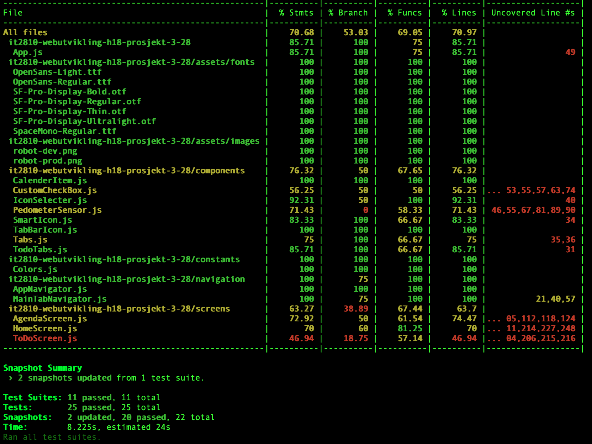

# Dokumentasjon for prosjekt 3 - PIMM
### it2810-webutvikling-h18-prosjekt-3-28
Dette er en "Personal Information and Motivation Manager" app. Vi har hat problemer med å kjøre appen. For å få appen til å fungere på iphone må man inn i `node_modules/whatwg-fetch/fetch.js` etter å ha installert prosjektet. Der må man bytte ut `typeof self !== 'undefined' ? self : this` med `global` i nederste linje. Dette må også gjøres for at testingen skal fungere med `npm test`.

 🚨 🚨 🚨 🚨 🚨 🚨 🚨 🚨 🚨 🚨 🚨 🚨 🚨 🚨 🚨 🚨 🚨 🚨 🚨 🚨 🚨 🚨 🚨 🚨 🚨 🚨 🚨 
 
Har fått tilbakemelding fra peergrade at folk har problem med installasjon. Vi har dessverre ingen løsning på problemet, men her er en demonstrasjon av en fungerende applikasjon:
[link](https://drive.google.com/file/d/1LeyrJRGn7mFjlwKchQOYRBH0epSEHKGK/view?usp=sharing)  

🚨 🚨 🚨 🚨 🚨 🚨 🚨 🚨 🚨 🚨 🚨 🚨  🚨 🚨 🚨 🚨 🚨 🚨 🚨 🚨 🚨 🚨 🚨 🚨 🚨 🚨 🚨 🚨 


## Innholdsfortegnelse
* [Verktøy og rammeverk](#verktoy)
* [Installering](#install)
* [Valg og løsninger](#losning)
* [Valg av teknologi(Tutorials)](#tutorial)
* [Testing](#testing)
* [Hva vi ikke fikk gjort](#todo)

<a name="verktoy"></a>
## Verktøy og rammeverk
* [React Native](https://facebook.github.io/react-native/) - "Build native mobile apps using JavaScript and React"
* [Expo](https://expo.io/) - "The fastest way to build an app"
* [Jest](https://jestjs.io/) - "Delightful JavaScript Testing"

<a name="install"></a>
## Installering
1. Klon repoet til ønsket sted på maskinen din
2. Naviger til mappen i terminal/kommandolinje og kjør `npm install` 

For å få appen til å fungere på iphone må man inn i `node_modules/whatwg-fetch/fetch.js` etter å ha installert prosjektet. Der må man bytte ut `typeof self !== 'undefined' ? self : this` med `global` i nederste linje. Dette må også gjøres for at testingen skal fungere med `npm test`.

3. Kjør deretter `expo start` for å åpne opp metro bundler i nettleseren. Her kan man åpne appen på mobil ved å scanne QR-koden, eller kjøre appen på ulike simulatorer lokalt

<a name="losning"></a>
## Valg og løsninger
Applikasjonen vår er basert på malen man får når man kjører expo init. 
Appen holder styr på kalenderen din ved å gi deg oversikt over hvilke avtaler og gjøremål du har de ulike dagene. Appen består av tre ulike skjermer og en navigasjonsbar på bunnen for å navigere mellom disse.

### HomeScreen(Home)
Hovedfunksjonaliteten til applikasjonen er at den gir deg en oversikt over dagen din idag, med ulike gjøremål(ToDos) og avtaler(Appointments). Dette skjer på HomeScreen, som også har innebygget funksjonalitet for en skritteller som teller opp mot dagens mål(f.eks 10 000 skritt). I tillegg kan man krysse av oppgaver man gjør i løpet av dagen, og følge med på hvor nærme man er å gjøre alt man har planlagt.

### AgendaScreen(Calendar)
Applikasjonen har også en skjerm som består av en kalender med oversikt over alle avtalene og gjøremålene framover og bakover i tid. Man kan trykke på hver enkelt dag og få opp en mer detaljert oversikt med ting som skjer den dagen, og i dagene etterpå. 

Agenda er en komponent fra react-native-calendars modulen. Vi var på utkikk etter en modul som kunne gi oss en kalender, og da vi kom over react-native-calendars, så vi at denne var relativt populær og godt dokumentert, så vi valgte å ta den i bruk. Agenda-komponenten var den komponenten som virket best tilpasset vårt formål, ved å ha en mer detaljert oversikt over hver enkelt dag, i tillegg til hver måned. 

Videre fant vi et godt eksempel på hvordan denne Agenda-komponenten var brukt og tilpasset i forbindelse med expo (https://github.com/expo/examples/blob/master/with-react-native-calendars/screens/agenda.js) og tok utgangspunkt i dette. Klassen ble tilpasset til å hente data fra AsyncStorage og legge disse inn i state.items, slik at ToDosene dukket opp i kalenderen. En del av eksempelet gikk ut på at det ble generert noen tilfeldige avtaler, slik at kalenderen ble fylt opp. Dette var noe vi valgte å også ta i bruk, slik at man ikke trenger å legge inn 20 ToDos når man skal teste kalenderen for å se om ting fungerer fint. Det er også laget en funksjon for å skille mellom utseendet på de tilfeldig genererte avtalene og de manuelt innlagte ToDosene.

### ToDoScreen(TODO)
ToDos blir lagt inn på en egen skjerm(TODO), hvor man skriver hva man skal gjøre, legger inn dato og kategori, samt hvem man skal gjøre det med. I ToDoScreen har fokuset vært validering av data og fungerende funksjonalitet. Det er også (ikke komplett) funksjonalitet for å legge inn en appointment istedenfor en ToDo.

Vi brukte lagringsstrukturen som ble brukt i Calendar-delen, slik at det skulle bli enkelt å flette sammen AsyncStorage og Calendar.


<a name="tutorial"></a>
## Valg av teknologier(Tutorials)
### Tutorial for Agenda-komponent: 
Man installerer [modulen](https://github.com/wix/react-native-calendars) fra github via npm
`$ npm install --save react-native-calendars`
Deretter trenger man å `import { Agenda } from 'react-native-calendars';`
Nå er det bare å ta i bruk komponenten ved å returnere `<Agenda/>`-taggen i klassen din sin render-funksjon.

 Agenda-komponenten har en rekke ulike properties man kan bruke for å endre utseende og funksjonalitet. Den viktigste er items, hvor man inkluderer de avtalene som skal være i kalenderen. Basert på eksempelet vi brukte, setter man items til å være this.state.items, og håndterer hvilke avtaler som er i staten i en egen funksjon, men disse kan også hardkodes inn som en value om man vil.
 
 Funksjonen som håndterte staten valgte vi å kalle på hver gang man endrer dag i kalenderen, eller når man scroller gjennom månedene, og dette ble gjort ved å binde denne funksjonen til Agenda-komponentens loadItemsForMonth, onDayPress og onDayChange-properties. Utenom dette har komponenten som nevnt en rekke properties for å endre utseende og funksjonalitet som vi ikke tok i bruk, men dette er godt dokumentert i linken på toppen. 

### React-native-elements
React-native-elements er et rammeverk for react native. Det fungere som et bibliotek, der man enkelt kan importere ulike komponenter. Innstallasjon gjøres via npm. Kommandoen for å innstallere er: npm i react-native-elements
eks: `
<Button
  title='BUTTON' />
`
Slik kan man enkelt legge til en knapp. En fin ting med RNE er at man enkelt kan legge til innebygde variabler. Dersom man vil ha en større knapp kan man legge inn large
eks:
```Javascript
<Button
  large
  rightIcon={{name: 'code'}}
  title='LARGE WITH RIGHT ICON' />
```
Her har man også lagt ved et icon på høyre side av knappen. 
Dersom man ønsker å style komponentene gjøres dette på samme måte som med andre komponenter, man legger inn ` style={styles.myStyling} ` 

Annet eksempel som er praktisk: `
<Text h1>Heading 1</Text>`
Dette returnere da en heading h1. 

<b>NB</b>
Noe vi fant ut i løpet av utviklingsperioden er at RNE ikke har så bra støtte til Android. For å bruke forrige eksempel, fungere dette strålende med iPhone, mens på Android overstyrerer tagen all ekstern styling. Så om du har lagt inn en spesiell font eller fontsize vil ikke dette vises på android, kun på iOS. 

For mer informasjon om RNE og en oversikt over de ulike komponentene, se:
https://react-native-training.github.io/react-native-elements/docs/0.19.1/overview.html
 
### Expo - LinearGradient
Expo har også mange fine innebygde komponenter. Den vi har brukt mest er LinearGradient

```Javascript
     <LinearGradient
         style={}
         start={{x: 0.0, y: 0.25}} end={{x: 0.5, y: 1.0}}
         colors={['#ff9fa7', '#ffd9a4']
         }>
     </LinearGradient>
```
Her legger man inn et start og slutt punkt (x,y - verdier), og en start og slutt farge, så lager den en gradient fargeovergang. Her har vi også merket oss at den fungere bedre og har en fyldigere fargeovergang på iOS enn android. 

### Expo - pedometer
Vi har valg å bruke pedometer i vårt prosjekt. Koden hentet vi fra https://docs.expo.io/versions/latest/sdk/pedometer
Komponenten fungere slik at den henter data fra helse-appen innebygd i telefonen. Det vil si Google fit eller Apple Helse. Vi bruker hvor mange steg du har gått i løpet av de siste 24-timene, og har satt et mål på at du skal gå 10 000 steg hver dag. Deretter “rendrer” vi en “progress-bar” som viser hvor langt du har igjen for å nå målet ditt og hvor mange kcal og km du har beveget deg. For beregninger har vi brukt generelle mål, dvs 0.04 kcals per steg og et at steg er 0.7m 

Siden dette er et Expo prosjekt følges begge komponentene med i prosjektet og trenger dermed kun å importeres. 

### Dropdown
https://www.npmjs.com/package/react-native-material-dropdown 

`npm install --save react-native-material-dropdown`

I prosjektet ble dropdown brukt for å hente ut hvilken person du skulle sette opp todo/appointment med. Denne komponenten er veldig enkel å bruke. Komponenten hentes med en enkel import.

```Javascript
import { Dropdown } from 'react-native-material-dropdown';
```

Deretter trenger du et datasett på et gitt format.

```Javascript
data = [
  {
  item: value, 
  item2: value, 
  item3: value
  }
]
```

I render kan man gjøre som vi gjorde i vårt prosjekt. Datasettet linkes som vist i koden under.

```Javascript
<Dropdown
               data={data}
               ref = {dropdown => this.dropdown = dropdown}
               label='I will do this with:'
             >
</Dropdown>
```

### DateTimePicker
https://www.npmjs.com/package/react-native-modal-datetime-picker

DateTimePicker kan installeres med npm.
`npm install --save react-native-modal-datetime-picker`

Slik importerer man komponenten:

```Javascript
import DateTimePicker from 'react-native-modal-datetime-picker';
```

Resten av koden er enkel samhandling mellom state og objektet. Objektet støtter både ios og android. Slik ser vår kode ut:
```Javascript
render(){
  return(
      <DateTimePicker
              isVisible={this.state.isDateTimePickerVisible}
              onConfirm={this._handleDatePicked}
              onCancel={this._hideDateTimePicker}
            />
  )
}
_showDateTimePicker = () => this.setState({ isDateTimePickerVisible: true });
_hideDateTimePicker = () => this.setState({ isDateTimePickerVisible: false });
_handleDatePicked = (date) => {
	// Your code here
 };
```

### TodoTabs
TodoTabs (og tabs.js) er en enkel modifikasjon av Tabs komponenten fra React Native Elements. For mer om react native elements les om "tutorials Homescreen". 
Kilde koden er funnet fra: https://react-native-training.github.io/react-native-elements/docs/button_group.html 

### IconSelector
Dette er et komponent som er implementert fra bunnen av. Komponentet består av to grupper med fire SmartIcons(vanlige icons med innlagt bakgrunnsfarge). Det kan se komplisert ut, måten vi sender informasjon ned til SmartIcon og opp til ToDoScreen, men det er i grunn bare enkle states som endres onPress.

### AsyncStorage:
AsyncStorage er en enkel og asynkron lagringsløsning som lagrer verdier på nøkkelattributter. Verdiene blir lagret lokalt slik at de ikke slettes om appen lukkes. AsyncStorage har flere metoder, men vi benyttet oss kun av .setItem(key, value) og .getItem(key, value). Disse metodene fungerer asynkront med resten av koden og returnerer et Promise-objekt. Dette objektet blir omgjort til de dataene som er lagret om de blir funnet og det ikke oppstår noe problem.

Når vi startet opp med Prosjekt 3 visste vi ingenting om React Native og heller ikke om AsyncStorage. På React Natives egen dokumentasjon står følgende: 

```
“It is recommended that you use an abstraction on top of AsyncStorage instead of AsyncStorage directly for anything more than light usage since it operates globally.”
```

Det anbefales altså å mellomlagre data i et eget nivå så man slipper å gjøre kall opp mot AsyncStorage gjevnlig. Vi leste rundt og ser for oss at Redux kunne vært en løsning som ville gjort dette prosjektet mye enklere. Vi valgte å ikke bruke Redux ettersom det ikke var et krav og vi ikke visste hvilke fordeler det ville gitt før vi var i sluttfasen av prosjektet. 

<a name="testing"></a>
## Testing
For testing i dette prosjektet var det et krav om å bruke Jest. Jest er et rammeverk som implementerer test-støtte i javascript. Jest kommer med i prosjektet automatisk når man lager prosjektet ved å bruke `expo-cli`og `expo init`.

Vi brukte våre egne mobiler, samt simulatorer jevnt gjennom hele prosjektet. Når vi testet appen vår gikk vi nøye og systematisk gjennom alle funksjoner i appen, i tillegg til å teste at UI fungerte som det skulle. Vi har brukt et variert utvalg av enheter fra IOS og Android. Vi brukte følgende simulatorer/mobiler: Iphone XS, Iphone X, Iphone 8, OnePlus 6(Android Pie), pluss emulatoren i Android Studio, med ulike devices og OS. Dette ga testing med et godt utvalg med skjermstørrelser, i tillegg til at vi fikk testet appen på både IOS og Android.

### npm test
Vi hadde i løpet av prosjektperioden store problemer med å få testrammeverket til å fungere. Vi fant ingen god løsning på problemet, men fikk testene til å kjøre på mac ved å endre på koden helt nederst i `node_modules/whatwg-fetch/fetch.js`
 Ved kloning av repo kommer dette til å være et problem, ettersom man får fila uendret. For å fikse dette må man endre `typeof self !== 'undefined' ? self : this` til `global`. Om person som tester ikke har mac, men ønsker å se testresultatene så er det lagt ved et bilde her.


For å teste med dekningsgrad kan man bruke følgende kommando i terminal:
`npm test -- --coverage`

### Snapshot
Snapshot-testing er nyttig for å sjekke at UI-ikke endrer seg uforventet. Testen renderer et komponent og tar bilde av strukturen som blir satt opp. Den sjekker så opp imot et allerede eksisterende bilde av strukturen(evt. fra første kjøring). Vi brukte en god del Snapshot-testing i våre komponenter. Vi satte oss et mål om at alle egenproduserte komponenter og screens skulle testes med snapshot, noe vi fikk til.

### Unit-testing
Vi brukte unit-testing for å sjekke om oppførselen til funksjonene våre var som planlagt. Vi gjorde dette med så mange funksjoner som mulig gjennom prosjektet, men støtte på noen problemer. Problemene som dukket opp var testing av funksjoner som brukte state til et child-element eller data lagret i AsyncStorage. Å lage en mock for lagringen i AsyncStorage kunne vært en løsning på problemet, men vi fikk ikke dette til å fungere som ønsket.

<a name="todo"></a>
## Hva vi ikke fikk gjort
Det er noen mangler og bugs når det gjelder sammenheng i appen vår. Man får lagret nye todos i AsyncStorage, men det er komplisert å laste inn dette dynamisk i de andre skjermene uten å mellomlagre data. Dette gjør at man i enkelte tilfeller må restarte appen for å hente data på nytt og kjøre render på nytt. I kalenderen må man bevege på seg i komponentet for at den skal oppdateres. Planen var at man også skulle kunne legge til appointments i ToDoScreen. Dette fikk vi ikke tid til. Vi ønsket også å knytte skrittelleren opp imot et personlig mål, noe vi ikke fikk tid til å implementere.

Kalenderen er ganske treg til å laste inn elementer. Dette fikk vi ikke tid til å fikse, men vi ser for oss at Redux også ville hjulpet oss med dette problemet.

